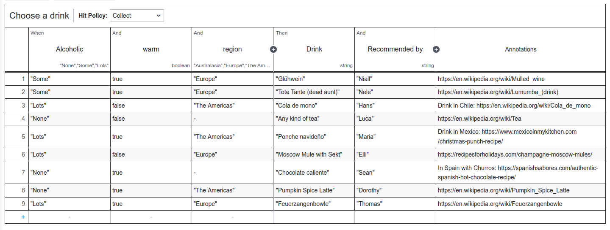

# Holiday FEELings 2022
This is a project for the holiday season 2022. We like to see your contributions on the topic of seasonal drinks &lt;3 We build a fun project using [FEEL](https://docs.camunda.io/docs/components/modeler/feel/what-is-feel/) expressions. 

## Starting the holiday season 2022
It is the time of the year again where people buy trees and put them into their house or have other holiday traditions.

It is also the time of the year that has its own food and more important: its own drinks. We would like to find out what the Camunda community around the globe drinks during the holiday season and created a DMN table for it: 

We invite you to contribute your drink here! 

In the second part of the project, we will use FEEL and the power of Process Automation to build something fun with this table - So stay tuned.

## How to contribute
1. [Fork](https://docs.github.com/en/get-started/quickstart/fork-a-repo) the project
2. Open the DMN table in the project (using [Camunda Web Modeler](https://accounts.cloud.camunda.io/signup) (part of Camunda's 8 SaaS offering) or [Desktop Modeler](https://camunda.com/download/modeler/))
3. Add your drink to the table
4. Create a [Pull request](https://docs.github.com/en/pull-requests/collaborating-with-pull-requests/proposing-changes-to-your-work-with-pull-requests/creating-a-pull-request)